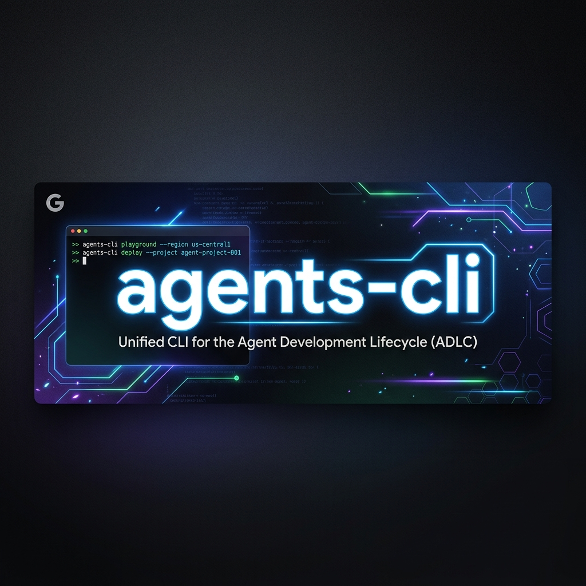
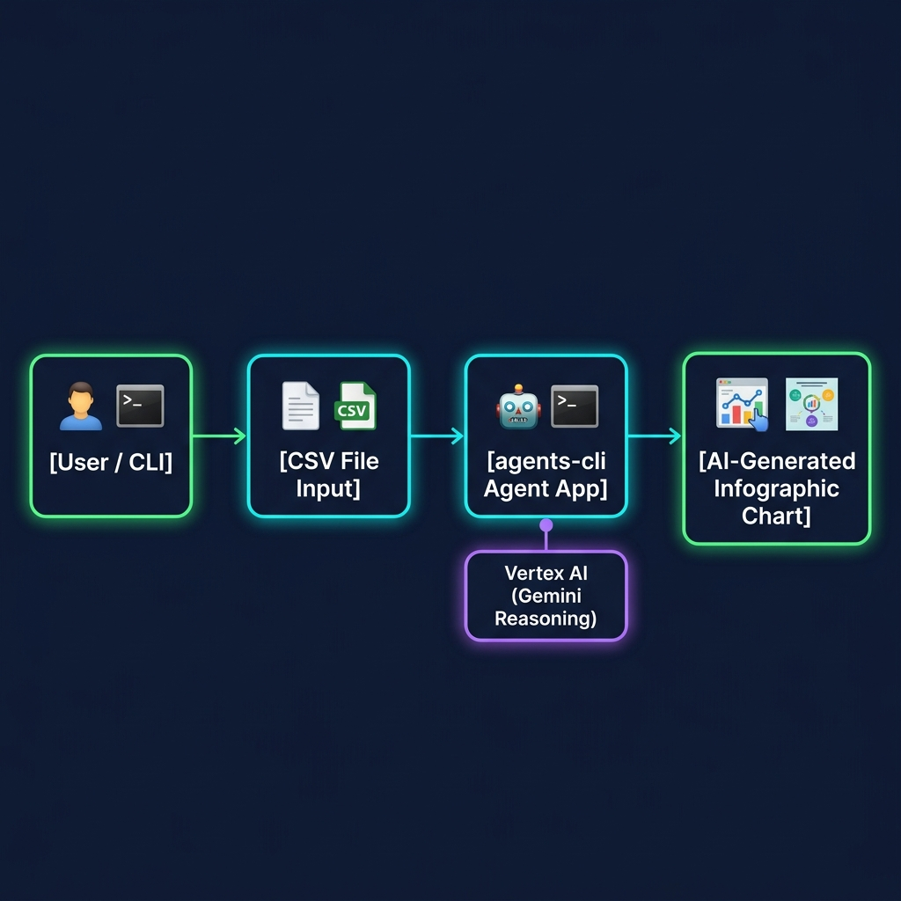
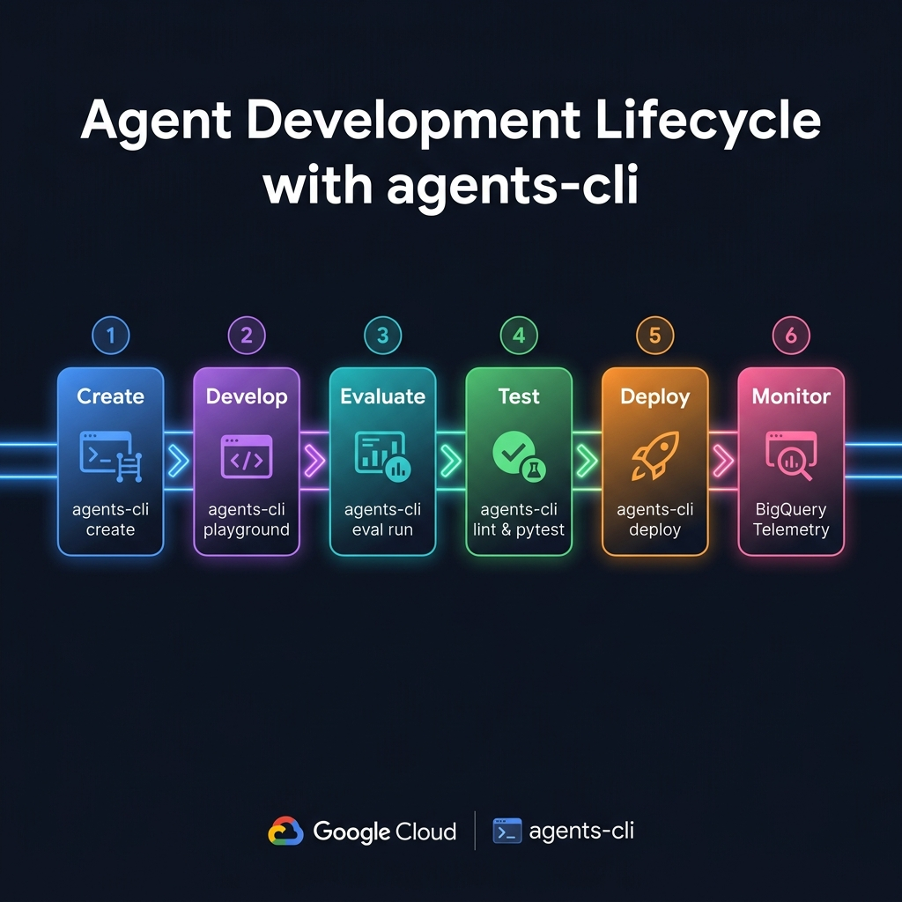

<div align="center">
  

  <br/><br/>

  [](https://pypi.org/project/google-agents-cli/)
  [](https://google.github.io/adk-docs/)
  [](https://deepmind.google/technologies/gemini/)
  [](https://python.org)

  <br/>
  <p><b>An AI CSV Analytics Agent scaffolded and deployed using Google's <code>agents-cli</code>.</b></p>
</div>

---

## 📖 Introduction

**InsightFlow AI** is a production-grade agentic application created using **`agents-cli`**—Google's unified CLI tool for the full Agent Development Kit (ADK) lifecycle. 

This repository serves as a blueprint showing how to build, evaluate, and deploy a Gemini-powered agent that takes CSV data inputs, writes code or builds charts, and outputs rich infographic summaries dynamically.

---

## 🏗️ Simple Architecture Flow

The system processes data through a simple sequential pipeline:

<div align="center">
  
</div>

1. **User / CLI:** Developer creates or deploys the agent with `agents-cli`, or a client sends prompts.
2. **CSV File Input:** User uploads a `.csv` file or pastes raw CSV text directly into the chat interface.
3. **agents-cli Agent App:** The core agent app (`app/agent.py`) coordinates instructions, system prompts, and tools.
4. **Vertex AI (Gemini Reasoning):** Gemini decides which tools to invoke based on the user's query.
5. **AI-Generated Infographic Chart:** The agent runs custom data analysis tools and outputs visual chart files (`/charts/infographic.png`).

---

## 🔄 Simple agents-cli Lifecycle

`agents-cli` manages the entire agent project lifecycle from local setup to cloud production:

<div align="center">
  
</div>

---

## 📊 Walkthrough: Generating an Infographic from CSV

Here is a step-by-step example of how the agent consumes a CSV dataset and outputs an infographic dashboard.

### 1. Launch the Application Locally
Run the FastAPI development server to enable local static chart rendering:
```bash
# Install agent dependencies
agents-cli install

# Start the uvicorn development server
uv run uvicorn app.fast_api_app:app --host 127.0.0.1 --port 8080 --reload
```
Open your browser and navigate to: **[http://127.0.0.1:8080/dev-ui/?app=app](http://127.0.0.1:8080/dev-ui/?app=app)**.

### 2. Provide a CSV Dataset
Paste raw CSV text directly in the playground chat or reference a local file:
```csv
Product,Revenue,Units Sold
Widgets,12000,300
Gadgets,18000,450
Gizmos,8500,210
Thingamabobs,15000,380
Doohickeys,9500,240
```

### 3. Ask the Agent for a Visualization
```text
"Analyze this data and generate an infographic dashboard"
```

### 4. Under the Hood execution
- The agent detects raw CSV text and calls `save_csv_content(csv_content)` to store it as `temp_data.csv`.
- The agent calls `generate_infographic("temp_data.csv")`.
- Matplotlib renders a dual-visualization dashboard:
  - Left Panel: **Bar chart** comparing sales volume.
  - Right Panel: **Pie chart** showing distribution percentages.
- The infographic is saved to `/charts/infographic.png`.
- The agent responds with the inline markdown tag `` showing the visual dashboard in your chat view.

---

## 🛠️ CLI Command Reference

Manage your agent workspace with these core `agents-cli` commands:

| Command | Purpose |
| :--- | :--- |
| **`agents-cli install`** | Installs dependencies specified in `pyproject.toml` |
| **`agents-cli playground`** | Launches the local interactive web UI chat playground |
| **`agents-cli eval run`** | Runs programmatic test cases against the defined evalsets |
| **`agents-cli lint`** | Checks your Python agent definitions for errors and warnings |
| **`agents-cli deploy`** | Packages your code in Docker and deploys to GCP Cloud Run |
| **`agents-cli infra single-project`** | Generates and runs Terraform to set up GCP infrastructure |

---

## 📁 Repository Map

```text
insightflow-ai/
├── agents-cli-manifest.yaml   # Declares agent type, layout config, and GCP region
├── GEMINI.md                  # Development guidelines for AI coding tools
├── Dockerfile                 # Container setup for production build
├── pyproject.toml             # Python libraries (Pandas, Matplotlib, FastAPI)
├── app/
│   ├── agent.py               # Core instructions, Gemini config, and custom chart tools
│   ├── fast_api_app.py        # Backend routes, static assets, and dev-ui mounts
│   └── app_utils/
│       ├── telemetry.py       # Observability logs integration
│       └── typing.py          # Shared runtime types
├── docs/                      # Images and diagrams
└── tests/
    ├── unit/                  # Local tool testing
    ├── integration/           # E2E server testing
    └── eval/                  # Golden test metrics
```

---

## ☁️ Deployment to Google Cloud Run

Ready to deploy to staging or production? Run:

```bash
# 1. Select target project
gcloud config set project <YOUR_PROJECT_ID>

# 2. Provision Google Cloud infrastructure (BigQuery, IAM, Artifact Registry)
agents-cli infra single-project

# 3. Deploy the application service
agents-cli deploy
```

---

<div align="center">
  <sub>Scaffolded with <b>agents-cli</b> · Powered by <b>Google ADK</b> & <b>Gemini</b> · Deployed on <b>Cloud Run</b></sub>
</div>
