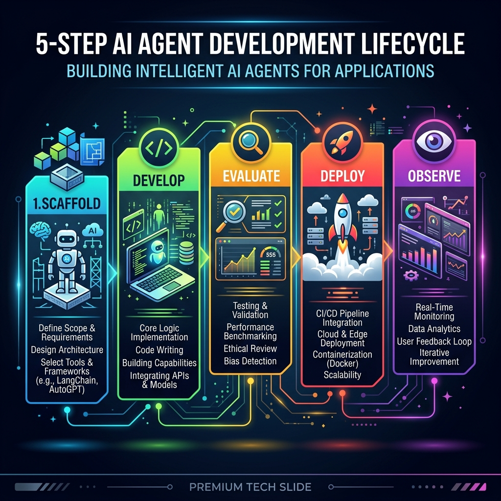

<div align="center">
  <h1>🧠 InsightFlow AI</h1>
  <p><b>Intelligent CSV Analytics AI Agent</b></p>
  <p>
    <a href="https://cloud.google.com/"></a>
    <a href="https://deepmind.google/technologies/gemini/"></a>
    <a href="https://python.org"></a>
  </p>
  <p><i>Powered by Google Agents CLI & Google ADK</i></p>
</div>

---

## 📖 Overview

**InsightFlow AI** is a production-ready Agentic AI system that acts as your personal Data Analyst. By simply uploading a CSV dataset, InsightFlow leverages Gemini's reasoning engine to automatically clean data, generate charts, and extract actionable business insights.

It demonstrates the full **Agent Development Lifecycle (ADLC)** from scaffolding to production deployment.

## 🔄 Agent Development Lifecycle (ADLC)

<div align="center">
  
  <p><i>The 5-Step AI Agent Development Lifecycle</i></p>
</div>

## ✨ Core Capabilities

*   **📊 Automated Visualizations:** Instantly generates bar charts, pie charts, and combined infographic dashboards from CSV data.
*   **💡 AI-Driven Insights:** Uses Python analytics workflows combined with LLM reasoning to highlight trends.
*   **🛠️ Tool Orchestration:** Built on Google ADK for seamless multi-tool execution and background processing.
*   **🔍 BigQuery Observability:** First-class telemetry and tracing exported directly to BigQuery.

---

## 🚀 Quick Start Guide

<details>
<summary><b>1️⃣ Prerequisites (Click to expand)</b></summary>

*   **[uv](https://docs.astral.sh/uv/getting-started/installation/)**: Fast Python package manager.
*   **agents-cli**: Install via `uv tool install google-agents-cli`
*   **[Google Cloud SDK](https://cloud.google.com/sdk/docs/install)**: Required for GCP deployments.

</details>

<details open>
<summary><b>2️⃣ Local Setup & Installation</b></summary>

Initialize the CLI and install dependencies:
```bash
uvx google-agents-cli setup
agents-cli install
```
</details>

<details open>
<summary><b>3️⃣ Chat with the Agent</b></summary>

Launch the interactive local playground:
```bash
agents-cli playground
```
Once running, upload `sales_data.csv` and ask: *"Analyze this dataset and show me the trends."*
</details>

---

## 📈 Dashboard Example

Whenever you upload a dataset, InsightFlow automatically visualizes the most critical metrics:

<div align="center">
  
  <p><i>InsightFlow AI generating instant charts from the provided sales dataset.</i></p>
</div>

---

## 📁 Repository Structure

```text
insightflow-ai/
├── app/
│   ├── agent.py               # Core ADK logic & custom tools (Charts, Insights)
│   └── fast_api_app.py        # FastAPI Backend server
├── tests/                     # Pytest suite for unit & integration testing
├── deployment/                # Terraform infrastructure definitions
├── pyproject.toml             # Python dependencies managed via uv
└── agents-cli-manifest.yaml   # Declarative agent configuration
```

## ☁️ Deployment

Deploy your agent to Google Cloud Run with a single command:

```bash
gcloud config set project <YOUR_PROJECT_ID>
agents-cli deploy
```

> [!TIP]
> Use the [Gemini CLI](https://github.com/google-gemini/gemini-cli) for AI-assisted development. Context is pre-configured in `GEMINI.md`.

> [!NOTE]
> This project is designed as a template for production-grade Agentic workflows on Google Cloud.
