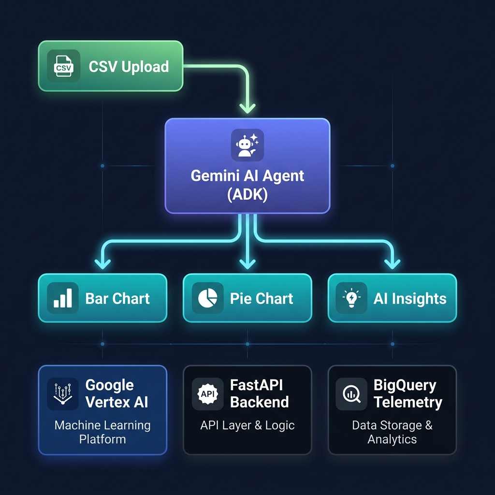

<div align="center">
  

  <br/><br/>

  [](https://pypi.org/project/google-agents-cli/)
  [](https://google.github.io/adk-docs/)
  [](https://deepmind.google/technologies/gemini/)
  [](https://python.org)
  [](https://cloud.google.com/run)

  <br/>
  <p><b>An AI analytics agent scaffolded with <code>agents-cli</code> — upload a CSV, get instant charts & insights.</b></p>
</div>

---

## 🤖 What is this?

**InsightFlow AI** is an AI agent built using **[google-agents-cli](https://pypi.org/project/google-agents-cli/)** — Google's official CLI for creating, testing, evaluating, and deploying production-grade AI agents on Google Cloud.

This project demonstrates the complete **agents-cli** lifecycle:

```
agents-cli create  →  agents-cli playground  →  agents-cli eval  →  agents-cli deploy
```

The agent itself is powered by **Google ADK** + **Gemini Flash** and acts as a personal data analyst — analyzing CSVs, generating charts, and surfacing AI insights.

---

## ⚡ Scaffolded with agents-cli

This project was bootstrapped with a single command:

```bash
# Install the CLI
uv tool install google-agents-cli

# Create the agent project
agents-cli create insightflow-ai
```

The CLI scaffolded the full project structure with:
- ✅ ADK agent template (`app/agent.py`)
- ✅ FastAPI backend (`app/fast_api_app.py`)
- ✅ Dockerfile for Cloud Run
- ✅ Terraform infra configs (`deployment/terraform/`)
- ✅ CI/CD with Cloud Build (`.cloudbuild/`)
- ✅ Eval harness (`tests/eval/`)
- ✅ Unit & integration test suite (`tests/`)
- ✅ `agents-cli-manifest.yaml` — declarative project config

---

## 🏗️ Architecture

<div align="center">
  
</div>

---

## 🚀 agents-cli Workflow

### 1. Install

```bash
uv tool install google-agents-cli
agents-cli install          # installs project dependencies via uv
```

### 2. Develop & Test Locally

```bash
# Launch the interactive playground UI
agents-cli playground
```

> [!NOTE]
> For chart image rendering to work inline, run the server directly via uvicorn instead:
> ```bash
> uv run uvicorn app.fast_api_app:app --host 127.0.0.1 --port 8080 --reload
> ```
> Then open **http://127.0.0.1:8080/dev-ui/?app=app**

### 3. Evaluate Agent Quality

```bash
# Run eval against the built-in evalset
agents-cli eval run
```

Evalsets are defined in `tests/eval/evalsets/` using the ADK eval schema. Iterate until your agent meets quality thresholds.

### 4. Lint & Test

```bash
# Code quality check
agents-cli lint

# Run unit + integration tests
uv run pytest tests/unit tests/integration -v
```

### 5. Deploy to Google Cloud Run

```bash
# One-time infra setup (Terraform)
agents-cli infra single-project

# Deploy the agent
agents-cli deploy
```

---

## 🛠️ Agent Capabilities

Built by customizing the scaffolded `app/agent.py`:

| Tool | What it does |
|---|---|
| `analyze_csv` | Loads a CSV and returns shape, columns, and sample rows |
| `generate_bar_chart` | Generates a bar chart PNG from the top numeric column |
| `generate_pie_chart` | Generates a pie chart showing distribution by category |
| `generate_infographic` | Combined bar + pie dashboard in one image |
| `generate_insights` | AI-driven trend summary and business recommendations |
| `save_csv_content` | Saves raw pasted CSV text to a temp file for further analysis |

**Example prompts in the playground:**
```
📌 "Analyze sales_data.csv and show me the trends"
📌 "Generate a bar chart from this file"
📌 "Give me a pie chart of Revenue by Region"
📌 "What are the key insights from this dataset?"
```

---

## 📁 Project Structure

```text
insightflow-ai/
├── agents-cli-manifest.yaml   # ← agents-cli project config (do not delete)
├── GEMINI.md                  # ← AI coding assistant context for this project
├── app/
│   ├── agent.py               # Core agent logic — tools, instructions, ADK App
│   ├── fast_api_app.py        # FastAPI server with /charts/ image endpoint
│   └── app_utils/
│       ├── telemetry.py       # OpenTelemetry + GCP Cloud Trace setup
│       └── typing.py          # Shared Pydantic types
├── tests/
│   ├── unit/                  # Tool-level unit tests
│   ├── integration/           # End-to-end API tests
│   └── eval/                  # ADK evalsets for LLM quality scoring
│       ├── evalsets/          # Golden Q&A pairs (agents-cli eval run)
│       └── eval_config.yaml   # Eval config (model judge, thresholds)
├── deployment/
│   └── terraform/             # GCP infra: Cloud Run, IAM, BigQuery, GCS
├── .cloudbuild/               # Cloud Build CI/CD pipeline configs
├── docs/                      # README images
├── Dockerfile                 # Container for Cloud Run deployment
└── pyproject.toml             # Python deps (managed via uv)
```

---

## 🔑 agents-cli Command Reference

| Command | Purpose |
|---|---|
| `agents-cli create <name>` | Scaffold a new agent project |
| `agents-cli install` | Install project dependencies |
| `agents-cli playground` | Launch local dev UI for interactive testing |
| `agents-cli eval run` | Run LLM-as-judge evaluation against evalsets |
| `agents-cli lint` | Check code quality |
| `agents-cli deploy` | Deploy agent to Cloud Run (dev environment) |
| `agents-cli infra single-project` | Provision GCP infrastructure via Terraform |
| `agents-cli infra cicd` | Set up full CI/CD pipeline with Cloud Build |
| `agents-cli scaffold upgrade` | Upgrade project to latest agents-cli version |

---

## ☁️ Deployment

This agent is Cloud Run–ready out of the box (scaffolded by `agents-cli`):

```bash
gcloud config set project <YOUR_PROJECT_ID>
agents-cli deploy
```

The Terraform configs in `deployment/terraform/` automatically provision:
- **Cloud Run** service with auto-scaling
- **BigQuery** dataset for agent telemetry & analytics
- **GCS bucket** for artifact storage
- **IAM** service accounts with least-privilege roles
- **Cloud Build** triggers for CI/CD

---

> [!TIP]
> Use **[Gemini CLI](https://github.com/google-gemini/gemini-cli)** for AI-assisted development in this repo. The `GEMINI.md` file pre-configures agent context and development phases.

> [!IMPORTANT]
> Ensure `gcloud auth application-default login` is completed and `GOOGLE_CLOUD_PROJECT` is set before running locally.

---

<div align="center">
  <sub>Scaffolded with <b>agents-cli</b> · Powered by <b>Google ADK</b> & <b>Gemini</b> · Deployed on <b>Cloud Run</b></sub>
</div>
