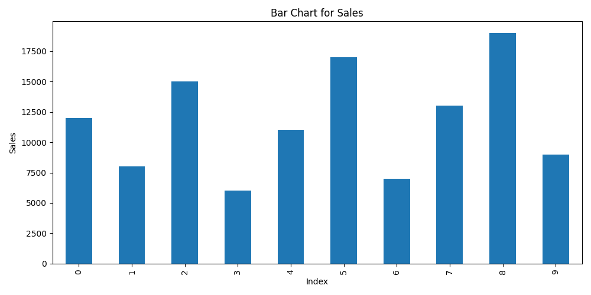

<div align="center">
  <h1>🧠 InsightFlow AI</h1>
  <p><b>Intelligent CSV Analytics AI Agent</b></p>
  <p>
    
    
    
  </p>
</div>

---

## 📖 Overview

**InsightFlow AI** is a production-ready AI Agent built with the Google Agents CLI and Google ADK. It acts as an intelligent data analyst, allowing you to upload CSV datasets and instantly generate business insights, bar charts, pie charts, and combined infographics. 

## ✨ Key Features
- **📊 Automated Visual Analytics**: Automatically generates bar charts, pie charts, and infographic dashboards from any provided CSV.
- **💡 AI-Generated Insights**: Connects Python analytics workflows with Gemini's reasoning to generate actionable business insights.
- **🛠️ Tool Orchestration**: Leverages the Google ADK to seamlessly execute multiple analytics tools in the background.
- **🔍 Built-in Observability**: Includes BigQuery analytics plugin for telemetry and tracing.

## 🚀 Quick Start

### 1. Requirements
Ensure you have the following installed:
- **uv**: Python package manager - [Install uv](https://docs.astral.sh/uv/getting-started/installation/)
- **agents-cli**: Google Agents CLI - Install with `uv tool install google-agents-cli`
- **Google Cloud SDK**: For GCP services - [Install](https://cloud.google.com/sdk/docs/install)

### 2. Setup

Install the CLI and its required skills:
```bash
uvx google-agents-cli setup
```

Install the project dependencies:
```bash
agents-cli install
```

### 3. Run the Agent Locally

Launch the local development environment and chat interface:
```bash
agents-cli playground
```
Once the playground is running, simply upload a CSV file (like the included `sales_data.csv`) and ask the agent to *"Analyze this dataset"*. The agent will automatically generate an infographic and summarize the data for you!

---

## 📈 Example Output

Whenever you provide a CSV file, InsightFlow AI automatically generates insightful visualizations.

<div align="center">
  
  <p><i>Example: AI-Generated Bar Chart from CSV Data</i></p>
</div>

---

## 📁 Project Structure

```text
insightflow-ai/
├── app/                  # Core agent code
│   └── agent.py          # Main agent logic and custom tools (charts, insights)
├── tests/                # Unit and integration tests
├── deployment/           # Infrastructure and deployment scripts
├── .cloudbuild/          # CI/CD pipeline configurations
├── pyproject.toml        # Project dependencies managed by uv
└── agents-cli-manifest.yaml # Agent configuration file
```

## 🛠️ Useful Commands

| Command | Description |
|---------|-------------|
| `agents-cli install` | Install dependencies using uv |
| `agents-cli playground` | Launch local chat and development server |
| `uv run pytest tests/` | Run automated tests |
| `agents-cli deploy` | Deploy agent to Google Cloud Run |

## ☁️ Deployment

To deploy the agent to your Google Cloud environment:
```bash
gcloud config set project <your-project-id>
agents-cli deploy
```

> 💡 **Tip:** Use [Gemini CLI](https://github.com/google-gemini/gemini-cli) for AI-assisted development - project context is pre-configured in `GEMINI.md`.
